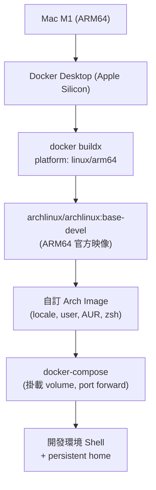
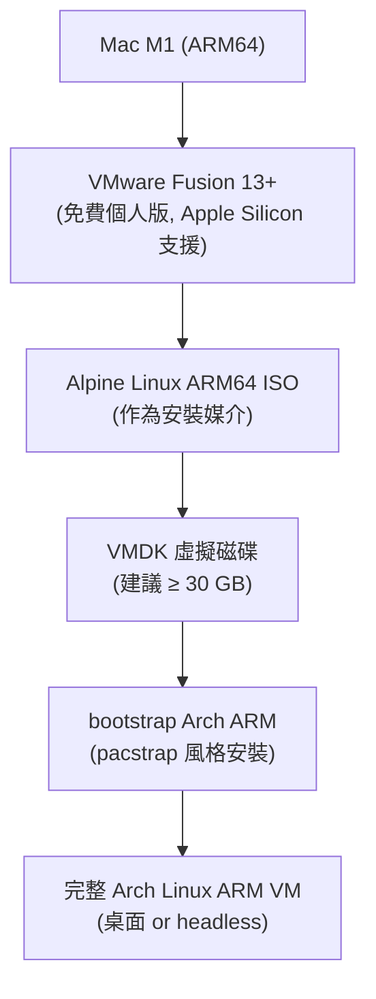

# Arch Linux on Mac M1 — 雙路徑建置計畫

> **實作順序：Path 1 VMware → Path 2 Docker**

## 專案目錄結構

```
fast_arch_os_inmac/
├── README.md
├── Makefile                    ← Docker 用
├── docker/
│   ├── Dockerfile
│   ├── docker-compose.yml
│   └── scripts/
│       ├── entrypoint.sh
│       └── bootstrap.sh
├── vmware/
│   ├── README.md               ← VMware 詳細步驟文件
│   └── scripts/
│       ├── arch-chroot-install.sh
│       └── post-install.sh
└── config/
    ├── pacman.conf
    ├── mirrorlist-arm
    └── locale.gen
```

---

## Path 1 (優先): VMware Fusion 虛擬機

### 架構重點



### 關鍵技術決策

- 使用 `archlinux/archlinux:base-devel` — 官方映像，支援 `linux/arm64`
- M1 原生執行，無需 Rosetta 模擬
- `docker-compose` 掛載具名 volume 保存 `/home`, `/root`, `/var/cache/pacman`
- `Makefile` 封裝常用指令：`make build`, `make up`, `make shell`, `make clean`

### Dockerfile 結構

```dockerfile
FROM archlinux/archlinux:base-devel
# 1. 初始化 keyring
# 2. 更新系統 + 安裝基礎工具 (git, zsh, neovim, openssh)
# 3. 設定 locale (zh_TW.UTF-8 + en_US.UTF-8)
# 4. 設定 timezone (Asia/Taipei)
# 5. 建立非 root 使用者 arch，加入 wheel
# 6. 設定 sudo 無密碼 (僅容器內)
# 7. 安裝 yay (AUR helper)
# 8. ENTRYPOINT: scripts/entrypoint.sh
```

### docker-compose.yml 結構

```yaml
services:
  arch:
    build: .
    platform: linux/arm64
    volumes:
      - arch-home:/home/arch        # 持久化 home
      - arch-pacman:/var/cache/pacman/pkg  # 快取 pacman 套件
      - .:/workspace                # 掛載專案目錄
    tty: true
    stdin_open: true
volumes:
  arch-home:
  arch-pacman:
```

### Makefile 指令

| 指令 | 功能 |
|------|------|
| `make build` | 建構 Docker 映像 |
| `make up` | 啟動容器（背景） |
| `make shell` | 進入互動式 shell |
| `make exec CMD=...` | 在容器內執行單一指令 |
| `make clean` | 移除容器與 volume |
| `make logs` | 查看容器輸出 |

### 執行流程

1. 安裝 Docker Desktop (Apple Silicon 版)
2. `git clone` 或初始化本專案
3. `make build` — 建構映像（約 5–10 分鐘）
4. `make shell` — 進入 Arch Linux 環境
5. 容器內可正常使用 `pacman`, `yay`, `zsh`

---

## Path 2 (其次): Docker 環境

### 架構重點



### 關鍵技術決策

- VMware Fusion 13 原生支援 ARM64 VM（免費個人授權）
- **Arch Linux 官方不提供 ARM64 ISO**，改用 **Alpine Linux ARM64 miniISO** 作為 live 環境，再手動 bootstrap Arch ARM
- Arch Linux ARM 根檔案系統來源：`http://os.archlinuxarm.org/os/ArchLinuxARM-aarch64-latest.tar.gz`
- 安裝腳本自動化：分割磁區、格式化、解壓 tarball、chroot 設定

### 分步驟安裝流程

**步驟 1 — 前置準備**
- 下載 VMware Fusion 13：`https://support.broadcom.com/group/ecx/productdownloads?subfamily=VMware+Fusion`
- 下載 Alpine Linux aarch64 ISO（約 150 MB）：`https://dl-cdn.alpinelinux.org/alpine/latest-stable/releases/aarch64/`

**步驟 2 — 建立 VMware 虛擬機**
- New VM → Custom → Other Linux 64-bit ARM
- 記憶體：≥ 2 GB（建議 4 GB）
- 磁碟：≥ 30 GB（NVME 模式）
- CD/DVD：掛載 Alpine ISO
- 啟動進入 Alpine live 環境

**步驟 3 — 磁碟分割與 Arch 安裝**（由 `vmware/scripts/arch-chroot-install.sh` 自動化）

```bash
# 在 Alpine live 環境內執行
# 1. 分割磁碟 (UEFI: 512MB EFI + 剩餘 root)
parted /dev/sda mklabel gpt
parted /dev/sda mkpart EFI fat32 1MiB 513MiB
parted /dev/sda mkpart root ext4 513MiB 100%

# 2. 格式化
mkfs.fat -F32 /dev/sda1
mkfs.ext4 /dev/sda2

# 3. 掛載
mount /dev/sda2 /mnt
mkdir -p /mnt/boot/efi && mount /dev/sda1 /mnt/boot/efi

# 4. 下載 Arch Linux ARM rootfs
wget http://os.archlinuxarm.org/os/ArchLinuxARM-aarch64-latest.tar.gz
tar -xzf ArchLinuxARM-aarch64-latest.tar.gz -C /mnt

# 5. chroot 設定
arch-chroot /mnt /vmware/scripts/post-install.sh
```

**步驟 4 — chroot 後設定**（`post-install.sh` 內容）

- 初始化 pacman keyring：`pacman-key --init && pacman-key --populate archlinuxarm`
- 設定 hostname, locale, timezone
- 設定 root 密碼 + 建立一般使用者
- 安裝 bootloader：`grub-install --target=arm64-efi`
- 安裝 VMware 工具：`open-vm-tools`
- (可選) 安裝桌面環境：XFCE / GNOME / Hyprland

**步驟 5 — 首次開機**

- 卸除 ISO，從 VMDK 開機
- 登入 Arch Linux VM
- `systemctl enable --now vmtoolsd` (VMware 整合)
- 可選：安裝 Display Server（Wayland 推薦 for ARM）

### VMware 進階設定

| 功能 | 設定方式 |
|------|----------|
| 共享資料夾 | VMware Fusion 設定 → Sharing → 指定 Mac 目錄 |
| 剪貼簿共享 | `open-vm-tools` 內建支援 |
| 網路 NAT | 預設，VM 可存取網際網路 |
| Bridged 網路 | 可選，讓 VM 有獨立 IP |
| 快照 | 安裝完成後立即建立快照 |

---

## 兩條路徑比較

| 面向 | Docker | VMware |
|------|--------|--------|
| 啟動速度 | 秒級 | 30–60 秒 |
| 隔離程度 | 核心共享（Mac kernel） | 完整 VM 隔離 |
| 磁碟佔用 | ~2 GB image | ~10–30 GB |
| systemd 支援 | 受限（需特殊設定） | 完整支援 |
| 桌面環境 | 不支援 GUI | 支援完整桌面 |
| ARM 原生執行 | 是（linux/arm64） | 是（ARM64 VM） |
| 適合場景 | 開發工具、CLI 工作流 | 完整 OS 體驗、系統級測試 |
